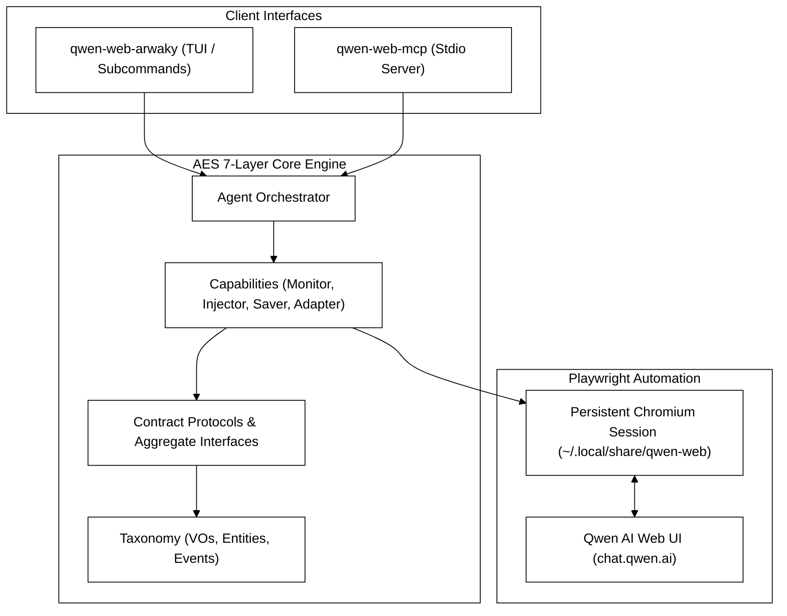

# Qwen AI Web Automation CLI & MCP Server

> Unlimited Qwen 3.8-Max Intelligence — Zero API Keys. Zero Rate Limits. 100% Uninterrupted.

[](https://www.python.org/)
[](https://playwright.dev/python/)
[](https://modelcontextprotocol.io/)
[](#architecture-aes-7-layer-pattern)
[](#testing--quality)
[](LICENSE)

---

**Qwen AI Web Automation CLI & MCP Server** turns `chat.qwen.ai` into a production-grade local automation engine. Send massive Markdown prompt files, attach documents, or stream deep-reasoning reports directly into your local codebase — without touching an API key.

---

<p align="center">
  
</p>

---

## Why Developers & AI Agents Choose This

> **Zero-Budget AI Freedom**: Built for indie developers, frugal engineers, students, and autonomous AI agents who refuse to burn cash on expensive API tokens.


| The Problem                           | How We Solve It                                              | Your Value                                                         |
| :-------------------------------------- | :------------------------------------------------------------- | :------------------------------------------------------------------- |
| **Expensive API Costs & Rate Limits** | Automates official`chat.qwen.ai` web interface               | **$0 API Costs**, unlimited model access                           |
| **Connection Drops Mid-Stream**       | Proactive**30s Cloud Reload Sync** prevents SSE timeouts     | **100% Completion** on long 15-minute runs                         |
| **Brittle DOM Scripts & Frozen UI**   | Multi-tier prompt injection with React`keyup` state sync     | **Zero Input Loss**, handles multi-line inputs seamlessly          |
| **Stale Chat Cross-Pollution**        | Automatic thread isolation (`_start_new_chat` resets `/c/*`) | **Clean Slate Guarantee** for every execution                      |
| **Hard to Integrate with AI Agents**  | Native 1:1**MCP Server over stdio**                          | **Instant Integration** with Claude, Cursor, Gemini, & Antigravity |

---

## Quick Start in 60 Seconds

### 1. Installation (Cross-Platform)

#### Automated Setup (Recommended)

- **Linux / macOS**:

  ```bash
  git clone https://github.com/rakaarwaky/qwen-web.git
  cd qwen-web
  ./scripts/install.sh
  ```
- **Windows (PowerShell)**:

  ```powershell
  git clone https://github.com/rakaarwaky/qwen-web.git
  cd qwen-web
  .\scripts\install.ps1
  ```
- **Universal Python Installer**:

  ```bash
  python3 scripts/install.py  # (or `python scripts/install.py` on Windows)
  ```

#### Manual Setup

```bash
pip install -e .
python3 -m playwright install chromium
```

### 2. Workspace Provisioning

Initialize standard XDG directory structures and local symlinks with one command:

```bash
qwen-web-arwaky init
```

### 3. One-Time Login Setup

Authenticate your session once. Persistent session tokens are saved securely under `~/.local/share/qwen-web/qwen_session` with `0o700` restricted permissions:

```bash
qwen-web-arwaky login
```

---

## Usage & Subcommands

### Interactive Terminal UI (TUI)

Run `qwen-web-arwaky` without arguments to launch the Textual TUI dashboard:

```bash
qwen-web-arwaky
```


---

### Direct Inline Prompt

Send a quick prompt string directly from your terminal or shell script:

```bash
qwen-web-arwaky prompt-direct -t "Explain quantum computing in 3 bullet points" -o output/result.md --headless
```

### Single Prompt File Processing

Process a Markdown prompt file:

```bash
qwen-web-arwaky prompt-only -i input/prompt.md -o output/audit_report.md --headless
```

### Prompt File Processing with Document Attachment

Send a prompt file along with a local PDF, Markdown, or text attachment:

```bash
qwen-web-arwaky prompt-with-attachment -i input/review_prompt.md -a input/spec.pdf -o output/review_result.md --headless
```

---

## Model Context Protocol (MCP) Server

Connect your local AI agent (Claude Desktop, Cursor, Gemini, or custom agents) directly to Qwen Web via MCP:

### MCP Server Command

```bash
qwen-web-mcp
```

### Example `claude_desktop_config.json` Configuration:

```json
{
  "mcpServers": {
    "qwen-web": {
      "command": "qwen-web-mcp",
      "args": []
    }
  }
}
```

### Available MCP Tools:

- `process_direct_prompt`: Process inline text prompts with configurable timeouts up to 900s.
- `process_prompt_file_only`: Process input Markdown prompt files and output results locally.
- `process_prompt_with_attachment`: Send prompt files together with document attachments.
- `setup_session`: Trigger an interactive browser session for manual re-authentication if session tokens expire.

---

## Reliability & Self-Healing Engine

- **30s Proactive Cloud Reload Sync**: Long deep-thinking prompts (e.g. 40KB+ enterprise reports) often trigger HTTP/2 SSE connection resets on `chat.qwen.ai`. Our engine automatically refreshes page state every 30s while Qwen is actively generating, pulling cloud snapshots without losing progress.
- **Instant DOM-Stable Completion Exit**: As soon as Qwen completes generation (Send button restored to active state), the monitor detects stability within 2-4 seconds and exits immediately -- no 120s timeout delay.
- **React Controlled Component State Sync**: Prompt injection uses a multi-tier strategy (React native value setter + synthetic `keyup` event + ContentEditable fallback) to prevent controlled textareas from wiping injected text upon submission.
- **XDG Symlink Maintenance**: Local `.qwen-web/` directories automatically map via symlinks to standard XDG data (`~/.local/share/qwen-web/output`) and state paths.

---

## Architecture: AES 7-Layer Pattern

This project strictly follows the **AES 7-Layer Architectural Spec** to ensure code modification safety for AI agents:

```text
Layer 1: Taxonomy     (VOs, entities, errors, events, constants)
Layer 2: Utility      (Stateless pure functions, no protocol impls)
Layer 3: Contract     (Protocol ABCs, aggregates, domain interfaces)
Layer 4: Capabilities (Business logic + Playwright adaptation, max 3 types/file)
Layer 5: Agent        (Orchestration via protocols only, zero direct I/O)
Layer 6: Surface      (CLI / MCP boundary handlers)
Layer 7: Root         (DI composition container & main entry points)
```

Enforced automatically by `lint-arwaky-cli` with **0 architectural layer violations**.



---

## Testing & Quality

- **227 Unit & Integration Tests**: 100% passing test suite covering contract protocols, DOM querying, prompt injection, and stream resilience.
- **Zero Lint Violations**: Rigorous MyPy (strict), Ruff, Bandit, and `lint-arwaky-cli` quality gates.

```bash
# Run unit test suite
pytest tests/ -v -m "not slow and not e2e"

# Run AES architectural compliance scan
lint-arwaky-cli scan modules/
```

---

## License

Distributed under the **MIT License**. See `LICENSE` for more information.
