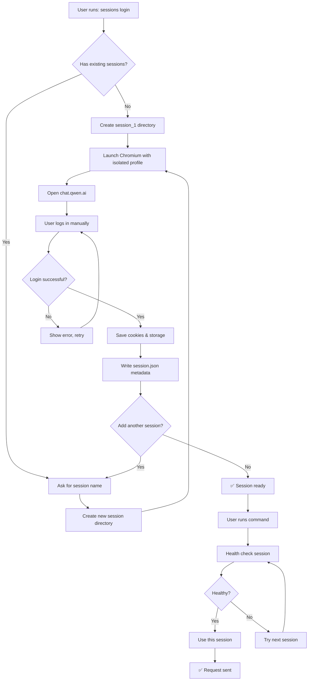

# Multi-Account Login User Flow

## Overview

User can login multiple Qwen accounts and store them as separate sessions. Each session has its own Chromium profile (cookies, local storage, etc.).

---

## Current Single-Session Flow

```
┌─────────────────────────────────────────────────────────────┐
│  Current: qwen-web-arwaky login                            │
└─────────────────────────────────────────────────────────────┘
                          │
                          ▼
              ┌───────────────────────┐
              │  1. Open browser      │
              │     (show Chromium)   │
              │                       │
              │  👤 Login to         │
              │     chat.qwen.ai    │
              │                       │
              │  2. Manual login     │
              │     (QR/code/scanner) │
              └───────────────────────┘
                          │
                          ▼
              ┌───────────────────────┐
              │  3. Save session      │
              │     ~/.qwen-web/      │
              │     qwen_session/     │
              └───────────────────────┘
                          │
                          ▼
              ✅ Single session ready
```

---

## New Multi-Session Flow

### Option A: Explicit Session Name (Recommended)

```
┌─────────────────────────────────────────────────────────────┐
│  New: qwen-web-arwaky sessions login --name personal       │
└─────────────────────────────────────────────────────────────┘
                          │
                          ▼
              ┌───────────────────────┐
              │  1. Ask for session   │
              │     name              │
              │                       │
              │  Enter name: personal │
              └───────────────────────┘
                          │
                          ▼
              ┌───────────────────────┐
              │  2. Create new profile│
              │                       │
              │  ~/.qwen-web/         │
              │  sessions/session_1/  │
              └───────────────────────┘
                          │
                          ▼
              ┌───────────────────────┐
              │  3. Open browser      │
              │     (isolated profile)│
              │                       │
              │  👤 Login as Account  │
              │     #1 (personal)     │
              └───────────────────────┘
                          │
                          ▼
              ┌───────────────────────┐
              │  4. Save session      │
              │                       │
              │  session_1/           │
              │  ├── Default/        │
              │  │   ├── Cookies     │
              │  │   └── Local State │
              │  └── session.json    │
              └───────────────────────┘
                          │
                          ▼
              ┌───────────────────────┐
              │  5. Ask next?         │
              │                       │
              │  Add another session? │
              │  [y/N]                │
              └───────────────────────┘
                          │
                    ┌─────┴─────┐
                    │           │
                   Yes          No
                    │           │
                    ▼           ▼
              ┌──────────┐  ┌──────────────┐
              │ Back to 1│  │ ✅ Done      │
              │ (session_2)│ │ Sessions: 1  │
              └──────────┘  └──────────────┘
```

---

### Option B: Interactive Session Picker

```
┌─────────────────────────────────────────────────────────────┐
│  User runs: qwen-web-arwaky login                          │
└─────────────────────────────────────────────────────────────┘
                          │
                          ▼
              ┌───────────────────────┐
              │  Check existing       │
              │  sessions             │
              │                       │
              │  Found: 2 sessions   │
              │    - session_1        │
              │    - session_2        │
              └───────────────────────┘
                          │
                          ▼
              ┌───────────────────────┐
              │  Show menu:           │
              │                       │
              │  1. Login new account │
              │  2. Use session_1     │
              │  3. Use session_2     │
              │  4. Health check all  │
              └───────────────────────┘
                          │
                    ┌─────┴─────┐
                    │           │
                   1            2/3
                    │           │
                    ▼           ▼
              ┌──────────┐  ┌──────────────┐
              │ New login│  │ Use existing │
              │ flow     │  │ session      │
              └──────────┘  └──────────────┘
```

---

## Detailed Step-by-Step Flow

### Step 1: Session Discovery

```bash
$ qwen-web-arwaky sessions list

📊 Session Pool Status
━━━━━━━━━━━━━━━━━━━━━━━━━━━━━━━━━━━━━━
 ID      │ Status  │ Last Used    │ Requests
━━━━━━━━━━━━━━━━━━━━━━━━━━━━━━━━━━━━━━
 session_1│ ✅ OK   │ 2 min ago    │ 47
 session_2│ ⚠️ Limit│ 1 hour ago   │ 123
 session_3│ ❓ Unknown│ Never      │ 0
━━━━━━━━━━━━━━━━━━━━━━━━━━━━━━━━━━━━━━
Total: 3 sessions | Healthy: 1 | Limited: 1 | Unknown: 1
```

### Step 2: Login New Session

```bash
$ qwen-web-arwaky sessions login --name "work"

🔐 Login to Qwen (Work Account)
━━━━━━━━━━━━━━━━━━━━━━━━━━━━━━━━━━━━━━
Creating isolated browser profile...
Opening chat.qwen.ai...

⏳ Please login manually in the browser window
   (Scanner/QR code/password)

💡 Tip: Close browser when done, or type 'done' here
━━━━━━━━━━━━━━━━━━━━━━━━━━━━━━━━━━━━━━
Waiting for login... (press Ctrl+C to cancel)

✅ Session 'work' saved!
   Path: ~/.qwen-web/sessions/session_4/
```

### Step 3: Health Check

```bash
$ qwen-web-arwaky sessions health-check

🏥 Running health checks...
━━━━━━━━━━━━━━━━━━━━━━━━━━━━━━━━━━━━━━
 session_1 │ ✅ Healthy  │ ping: 1.2s
 session_2 │ ❌ Limited  │ rate limit detected
 session_3 │ ✅ Healthy  │ ping: 0.8s
 session_4 │ ✅ Healthy  │ ping: 1.5s
━━━━━━━━━━━━━━━━━━━━━━━━━━━━━━━━━━━━━━
Result: 3/4 sessions healthy
```

### Step 4: Run with Auto-Rotation

```bash
$ qwen-web-arwaky prompt-direct -t "Hello"

🔄 Session rotation active
━━━━━━━━━━━━━━━━━━━━━━━━━━━━━━━━━━━━━━
Trying session_1... ✅ Success!
(0 ms fallback time)

Response: Hello! How can I help you today?
━━━━━━━━━━━━━━━━━━━━━━━━━━━━━━━━━━━━━━
```

### Step 5: Session Hits Limit

```bash
$ qwen-web-arwaky prompt-direct -t "Hello again"

🔄 Session rotation active
━━━━━━━━━━━━━━━━━━━━━━━━━━━━━━━━━━━━━━
Trying session_1... ❌ Rate limited
Trying session_2... ❌ Rate limited  
Trying session_3... ✅ Success!
(2.3s fallback time)

Response: Hi there! What can I do for you?
━━━━━━━━━━━━━━━━━━━━━━━━━━━━━━━━━━━━━━
```

---

## Browser Isolation Strategy

### Chromium Profile Per Session

```
~/.qwen-web/
├── sessions/
│   ├── session_1/
│   │   ├── Default/
│   │   │   ├── Cookies           ← Isolated cookies
│   │   │   ├── Local Storage     ← Isolated storage
│   │   │   ├── Cache             ← Isolated cache
│   │   │   └── Preferences
│   │   └── session.json          ← Metadata
│   ├── session_2/
│   │   └── ...
│   └── session_3/
│       └── ...
└── sessions.json                 ← Pool config
```

### Playwright Launch Options

```python
# Each session gets isolated browser context
browser = await launch_chromium(
    headless=False,
    user_data_dir=f"{SESSION_DIR}/session_1/Default",
    args=[
        "--profile-directory=Default",
        "--no-first-run",
        "--no-default-browser-check",
    ]
)
```

---

## CLI Commands Reference

### Session Management

```bash
# List all sessions
qwen-web-arwaky sessions list

# Add new session
qwen-web-arwaky sessions login --name "personal"
qwen-web-arwaky sessions login --name "work"
qwen-web-arwaky sessions login --name "test"

# Remove session
qwen-web-arwaky sessions remove session_2

# Health check all sessions
qwen-web-arwaky sessions health-check

# Show session status
qwen-web-arwaky sessions status
```

### Usage with Commands

```bash
# Auto-rotate sessions (default)
qwen-web-arwaky prompt-direct -t "Hello"

# Force specific session
qwen-web-arwaky prompt-direct -t "Hello" --session session_1

# Show which session was used
qwen-web-arwaky prompt-direct -t "Hello" --verbose
```

---

## TUI Integration

### Session Tab in TUI

```
┌─────────────────────────────────────────────────────────────┐
│  🏠 Home  │  ▶️ Slots  │  🐝 Swarm  │  👤 Sessions  │  📊 Logs │
└─────────────────────────────────────────────────────────────┘

  👤 Sessions
  ━━━━━━━━━━━━━━━━━━━━━━━━━━━━━━━━━━━━━━━━━━━━━━━━━━━━━━━━━━━━
  ID      │ Status  │ Last Used    │ Requests │ Actions
  ━━━━━━━━━━━━━━━━━━━━━━━━━━━━━━━━━━━━━━━━━━━━━━━━━━━━━━━━━━━━
  session_1│ ✅ OK   │ 2 min ago    │ 47      │ [Health]
  session_2│ ⚠️ Limit│ 1 hour ago   │ 123     │ [Remove]
  session_3│ ✅ OK   │ 5 min ago    │ 23      │ [Health]
  session_4│ ❓ ?    │ Never        │ 0       │ [Health]
  ━━━━━━━━━━━━━━━━━━━━━━━━━━━━━━━━━━━━━━━━━━━━━━━━━━━━━━━━━━━━
  
  [+ Add Session]  [Health Check All]
```

---

## Error Handling Flow

### Rate Limit Detected

```
Session 1 → Send request → Response contains "upper limit"
                    ↓
            Mark session_1 as LIMITED
                    ↓
            Try session_2 → Success ✅
                    ↓
            Log: "Rotated to session_2 (session_1 rate-limited)"
```

### All Sessions Limited

```
Session 1 → ❌ Limited
Session 2 → ❌ Limited
Session 3 → ❌ Limited
                    ↓
            Raise AllSessionsLimitedError
                    ↓
            User sees:
            "All 3 sessions are rate-limited. Please wait until 
             tomorrow or add more sessions."
                    ↓
            Suggest: qwen-web-arwaky sessions login --name "backup"
```

---

## Login Flow Diagram (Mermaid)



---

## Security Notes

1. **Session files contain cookies** — treat as sensitive data
2. **Don't commit session files** to git (add to .gitignore)
3. **Encrypt if storing cloud-synced** (optional future feature)
4. **Each session is independent** — no shared state

---

## Future Enhancements

| Feature | Description | Priority |
|---------|-------------|----------|
| Cloud sync | Sync sessions across devices | P2 |
| Auto-cleanup | Remove old/unused sessions | P2 |
| Session naming | Custom names instead of session_N | P3 |
| Session export/import | Backup & restore sessions | P3 |
| Session sharing | Share sessions between users | P4 |
